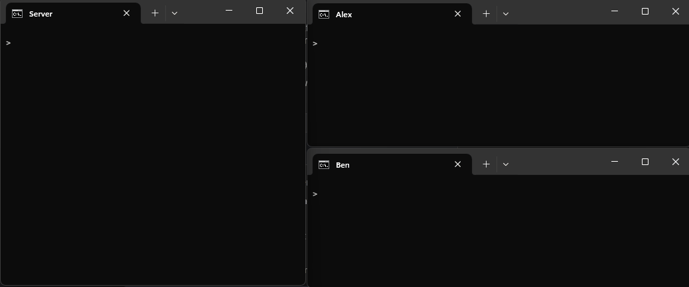

# Multi-Client TCP Chat Server in C++

A high-performance, multi-client TCP chat server built with C++ and the Winsock API for Windows. This project demonstrates core networking concepts, including socket programming, concurrent client management with threading, and building a simple application-layer protocol.



---

## About The Project

This project was created to provide a hands-on understanding of how modern networked applications handle multiple simultaneous connections. The server listens for incoming TCP connections and spawns a dedicated thread for each client. This allows for non-blocking, concurrent communication, where messages from any client are instantly broadcast to all other connected clients.

### Key Features:
- **Concurrent Client Handling**: Uses `std::thread` to manage multiple clients at once without blocking the main server loop.
- **Message Broadcasting**: Relays messages from a sender to all other participants in the chat.
- **Graceful Disconnection**: Detects when a client disconnects and notifies the remaining users.
- **Cross-Platform Foundation**: Built with standard C++ libraries and platform-specific networking APIs (Winsock for Windows), making it adaptable.

### Built With
* C++ (C++11 or later)
* Windows Socket API (Winsock2)
* `std::thread` for concurrency
* `std::mutex` for thread-safe access to shared resources

---

## Getting Started

Follow these instructions to get a copy of the project up and running on your local machine for development and testing.

### Prerequisites

You will need a C++ compiler installed on Windows that supports C++11 and POSIX threads. The recommended toolchain is **MinGW-w64**.

1.  **Install VS Code C/C++ Extension**: Provides IntelliSense and debugging.
2.  **Install MinGW-w64**:
    * Install **MSYS2** from [their official website](https://www.msys2.org/).
    * Open the MSYS2 terminal and run `pacman -S mingw-w64-ucrt-x86_64-gcc` to install the compiler.
    * Add the compiler's path (e.g., `C:\msys64\ucrt64\bin`) to your Windows PATH environment variables.

### Compilation

1.  **Compile the Server**:
    ```bash
    g++ -o server.exe server.cpp -pthread -lws2_32
    ```
2.  **Compile the Client**:
    ```bash
    g++ -o client.exe client.cpp -pthread -lws2_32
    ```
    *(Note: The `-lws2_32` flag is crucial for linking the Winsock library on Windows.)*

---

## Usage

1.  **Run the Server**: Open a terminal and start the server, specifying a port.
    ```bash
    ./server.exe 8080
    ```
2.  **Run the Client(s)**: Open one or more new terminals and connect to the server's IP address (`127.0.0.1` for local) and port.
    ```bash
    # In Terminal 2
    ./client.exe 127.0.0.1 8080

    # In Terminal 3
    ./client.exe 127.0.0.1 8080
    ```
Now you can send messages between the client terminals!

---

## Testing Scenario

This testing plan verifies the core functionality: multi-client communication and graceful disconnection.

### Setup
* **1 Server Instance**
* **2 Client Instances** (referred to as Client A and Client B)

### Test Steps & Expected Results

| Step | Action                                             | Expected Result                                                                                               |
| :--- | :------------------------------------------------- | :------------------------------------------------------------------------------------------------------------ |
| 1    | Start the server on port `8080`.                   | The server console displays: `Server listening on port 8080...`                                               |
| 2    | Start Client A, connecting to `127.0.0.1:8080`.    | **Client A:** Displays `Connected to the server...`<br>**Server:** Displays `New client connected.`               |
| 3    | Start Client B, connecting to `127.0.0.1:8080`.    | **Client B:** Displays `Connected to the server...`<br>**Server:** Displays `New client connected.`               |
| 4    | On Client A, type `Hello everyone!` and press Enter. | **Client B's terminal** displays the message, e.g., `Client <ID>: Hello everyone!`. The message does not appear on Client A. |
| 5    | On Client B, type `Hello back!` and press Enter.     | **Client A's terminal** displays the message, e.g., `Client <ID>: Hello back!`.                               |
| 6    | Close the Client A terminal (or press `Ctrl+C`).   | **Client B's terminal** displays a message like `Client <ID> has left the chat.`<br>**Server:** Logs `Client <ID> disconnected.` |
| 7    | On Client B, type `Is anyone still here?`.         | The message is sent, but no other client receives it. The server continues to run without errors.             |

---

## Future Improvements

- [ ] **Usernames**: Allow clients to pick a username instead of being identified by a socket ID.
- [ ] **Private Messaging**: Implement a command like `/whisper <username> <message>`.
- [ ] **User List**: Add a `/list` command to show all connected users.
- [ ] **Server-side Commands**: Implement commands for the server admin (e.g., `/kick <username>`).
